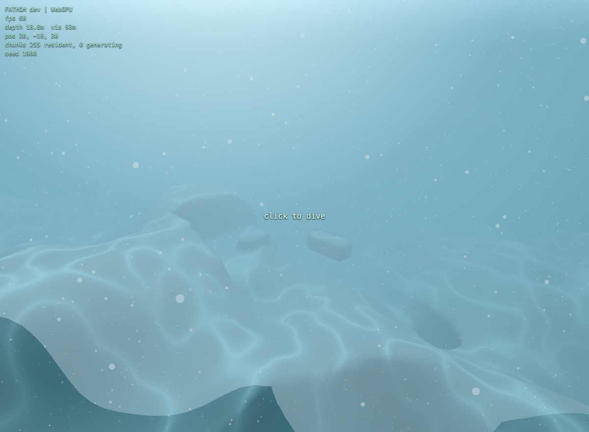
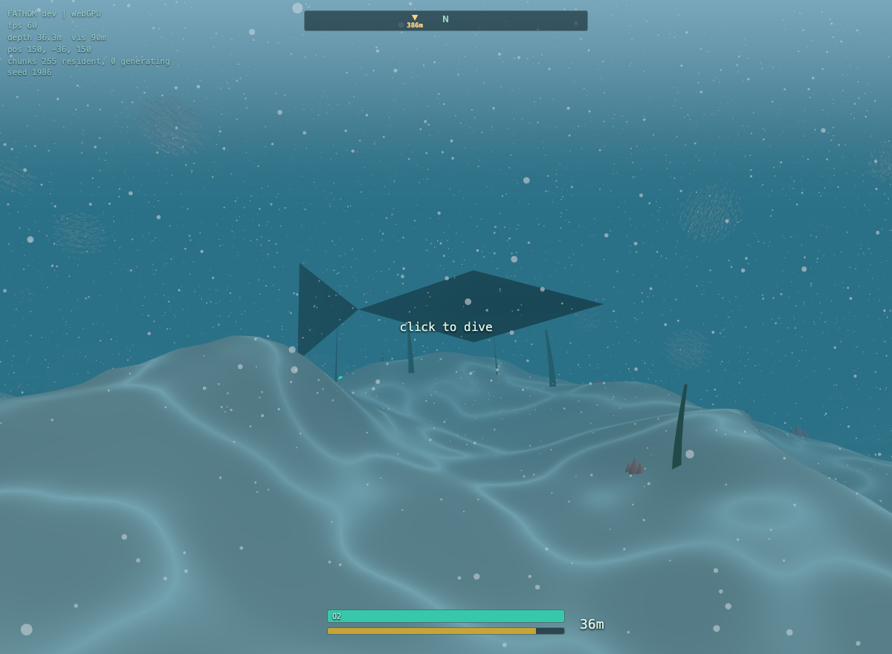

# FATHOM

A survival-horror exploration game set in an infinite procedurally generated
ocean, running entirely in your browser on WebGPU (three.js r184) with an
automatic WebGL2 fallback.

**Play it: https://neilp211.github.io/fathom/**

Eight months ago the Meridian deep-survey expedition stopped transmitting.
You are the salvage contractor sent to find out why. Scavenge the sunlit
shallows, build a one-person submersible, and follow the signal chain down a
descending seafloor to an 800m abyss, piecing together what happened from the
logs the crew left behind. Something down there senses light and sound. Your
engine is a beacon.

## How to play

| Input | Action |
|---|---|
| Click | dive (pointer lock) |
| WASD + mouse | swim / pilot |
| Space / Shift | ascend / descend |
| E | interact, board, disembark (hold E to scan fragments) |
| F | flashlight (some things flee it; deeper things come) |
| Q | sonar ping (sub only; useful, loud) |
| G | drop a flare (decoy) |
| Tab | PDA: inventory, crafting, journal, settings |

The loop: dive, grab scrap, surface, craft at the buoy fabricator. Your first
five minutes get you the scanner; everything else unlocks by scanning wreck
fragments along the signal chain. Oxygen is short. Depth is gated by suit and
hull ratings. Death rolls you back to your last save (autosaved at the buoy
and the sub).

## What is under the hood

- Infinite deterministic terrain: a seeded 3D density field (caves, overhangs,
  a radial descent to an abyssal plain) meshed by chunked marching cubes in a
  Web Worker pool, streamed by fog-bounded visibility. No LOD needed: the murk
  is the optimization.
- GPU ecosystem: 5,000 boid fish in a TSL compute pass that reacts to light,
  noise, predators, and sonar through a shared stimulus system; 50k marine
  snow particles that run even on the WebGL2 fallback (transform feedback).
- One predator archetype parameterized by depth band, and one Hunter: a
  territorial leviathan you hear long before you see, attracted to light and
  engine noise, with flares as counterplay.
- Synthesized audio only: two-bus design (the ocean muffles with depth; the
  cabin stays warm), brown-noise bed, rumble stingers, sonar chirps.
- Persistence in IndexedDB keyed by world seed: terrain is never saved, only
  diffs (the seed regenerates the planet).
- 71 unit tests on the pure cores (worldgen determinism, survival rules,
  threat math, signal chain).

Built with three.js `0.184.0` (`three/webgpu` + `three/tsl`), Vite, Vitest,
and no other runtime dependencies beyond `simplex-noise` and `alea`.

## Run locally

    npm install
    npm run dev

Open http://localhost:5173 (Chrome, Edge, Safari 26+, or Firefox 141+).
WebGPU needs a secure context: localhost works, plain http over a LAN IP does
not. Append `?webgl=1` to force the WebGL2 fallback, `?q=low` for low quality.

    npm test

## Design docs

The full spec and per-milestone plans live in `docs/superpowers/`. The perf
history is in `docs/perf-log.md`.
